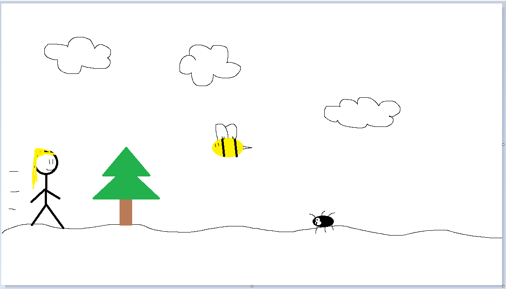

# Project1

Elevator Pitch:
The game is a scrolling style game and will be 2D. Main character will be SailorMoon(maybe). She has to get home after a long day of fighting crime, but the road she usually takes has been closed off and she has to take the backroad home. However, there are a variety of obstacles that she has to either jump over or duck under. Sailormoon will be continuously running and the player will have the ability to control when she jumps or ducks. The score will be calculated by the amount of time that the player survives. As the player moves forward Sailormoon will move faster and there will be more obstacles appearing on screen/ on the road that she is has to avoid.

Tech Stack: HTML, JS, CSS, phaser.io(maybe) or createJS(maybe).
My plan for the background is to have a sunset sky color style with clouds. Then a path that Sailormoon will be walking on and where all the obstacles will be.
A score will appear on the right hand corner of the game. Score will be calculated by distance travelled on the x-axis.
A collision will be calculated with a function and if else statements. The object will have a position on the x-y axis and have a set height and width. Then using an if else to determine if the character has hit any obstacles.
There will be function for the main characters that calculates her position based on the size of the game and will have her set width and height.
EventListeners will be created for the keypress for the characters movement in the game. I will also have a 2 functions for when my character jumps

WireFrames for the game:

Minium viable product(MVP) goal aka base requirements for finished product:
-Start game window
-scrolling obstacles and backgroun
-a score counter
-a player controlled main character (controlled with up and down arrow keys)
-detecting when character gets hit my an obstacle

stretch goals:
Stretch goals is to add an item that the character can pick up that allows her to shoot out a laser to shoot obstacles. Will last for about 5 uses.
Play sound during gameplay and play sound when the character hits an obstacle.

potential roadblocks:
-Randomly generating obstacles and making sure they to appear in the correct spot.
-Making sure that if my character hits obstacles that my character.
-Generating more obstacles as the game increases in difficulty
-Getting my character to move a bit faster as the game increases in difficulty.
